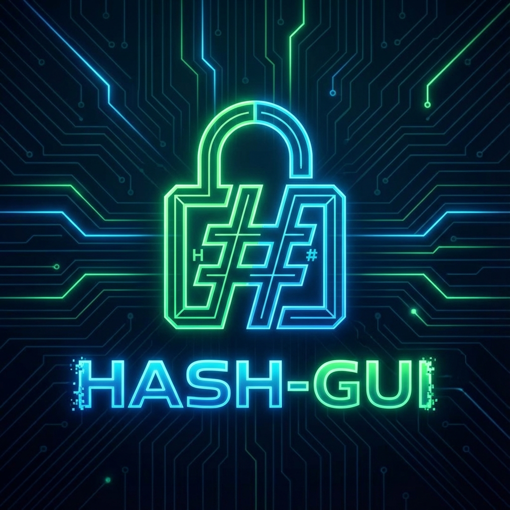
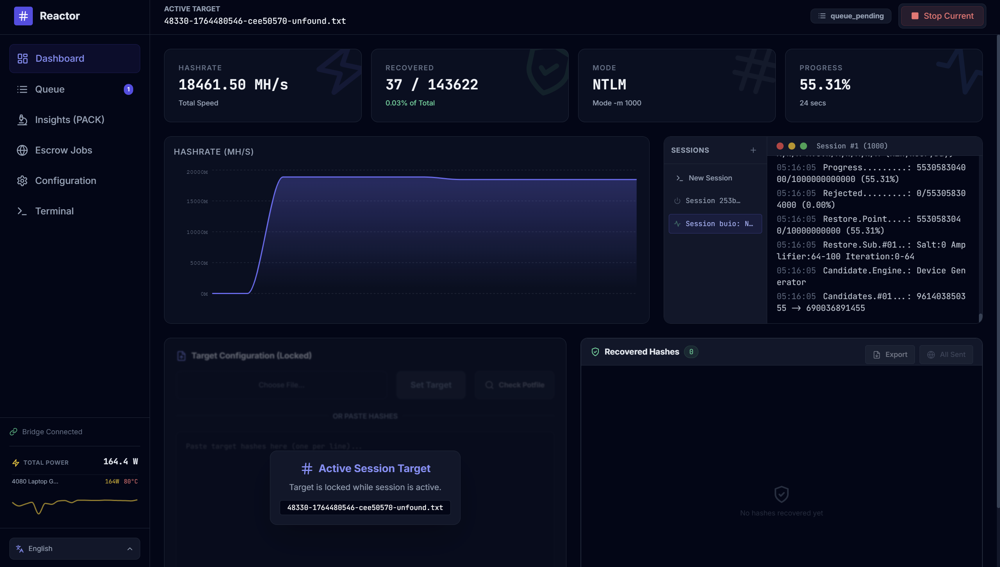
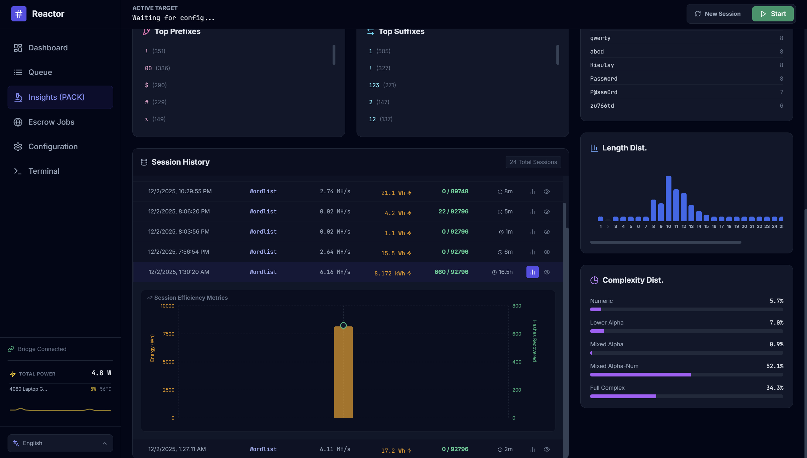
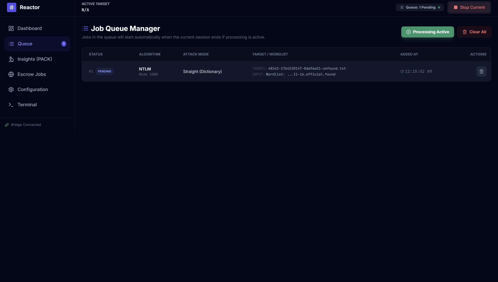
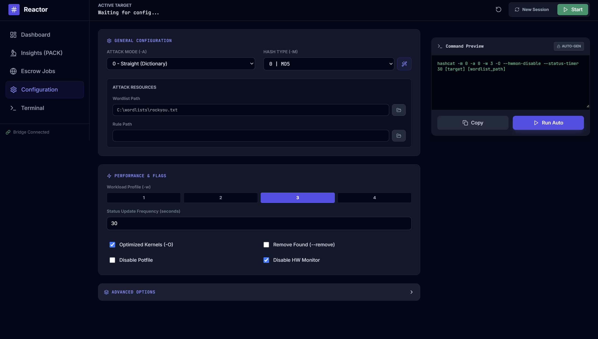
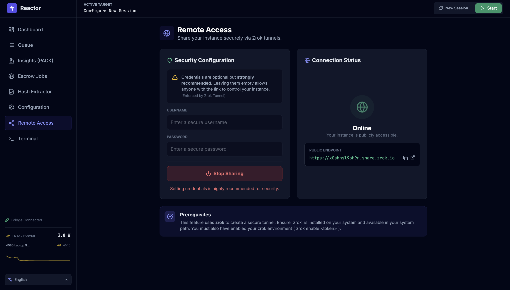
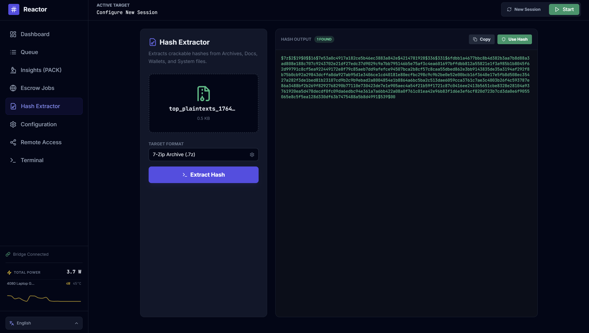

# Hash-GUI



<div align="center">

[](https://opensource.org/licenses/MIT)
[](https://github.com/jjsvs/Hash-GUI)
[](https://github.com/jjsvs/Hash-GUI/releases)
[](http://makeapullrequest.com)

**The Ultimate Professional Frontend for Hashcat**

*Modernize your cracking workflow with real-time analytics, remote management, and intelligent automation.*

[Report Bug](https://github.com/jjsvs/Hash-GUI/issues) · [Request Feature](https://github.com/jjsvs/Hash-GUI/issues)

</div>

---

## 📖 Overview

**Hash-GUI** is an enterprise-grade graphical interface designed to unlock the full potential of **Hashcat**. It bridges the gap between raw command-line power and user-friendly operation, offering a suite of tools for penetration testers, security researchers, and system administrators.

Gone are the days of complex syntax and manual monitoring. Hash-GUI provides a centralized command center for all your password recovery tasks, featuring intelligent job queuing, automated reporting, and secure remote access.

## ✨ Key Features

### 🖥️ **Command Center Dashboard**
Experience your cracking sessions in real-time. Visualize hashrates, temperature, fan speeds, and progress through dynamic graphs and live telemetry via WebSockets.

### 🔗 **Secure Remote Access**
Manage your rig from anywhere.
- **Zrok Integration**: Built-in support for secure, tunneled remote access without exposing ports.
- **Authentication**: Optional but recommended username/password protection for your remote sessions.

### 🕵️ **Intelligent Analysis (PACK)**
Don't just guess—analyze.
- **Automated Insights**: Integrated **Password Analysis and Cracking Kit (PACK)** analyzes your potfile and recovered hashes.
- **Optimized Masks**: Automatically generate highly efficient masks based on real-world patterns found in your cracked lists.

### 📂 **Universal Hash Extractor**
Simplify target preparation.
- **File2John Support**: Extract crackable hashes directly from specialized files:
    - **Archives**: 7-Zip, RAR, ZIP
    - **Documents**: Office, PDF
    - **Wallets**: Crypto wallets (Bitcoin, Ethereum, etc.)
    - **System**: SSH keys, shadow files, etc.

### 🤖 **Automated Workflows**
- **Job Queue**: Stack multiple attacks (Wordlist -> Mask -> Hybrid) to run sequentially.
- **Auto-Escrow**: Automatically upload recovered hashes to online escrow services (like Hashes.com) to monetize your compute power.
- **Pre-Crack Audits**: Instantly check new target lists against your existing potfile to avoid redundant work.

### 💻 **Power User Tools**
- **Interactive Terminal**: Drop into a fully functional shell for manual Hashcat commands when you need total control.
- **Hardware Monitoring**: Native integration with `nvidia-smi` for real-time GPU health tracking.
- **Multi-Language**: Fully localized for **English** and **Chinese (中文)**.

---

## 📸 Interface Tour

| **Strategic Overview** | **Deep Analytics** |
|:---:|:---:|
| <br>_Real-time telemetry and session control_ | <br>_Pattern analysis and mask generation_ |

| **Process Management** | **System Level Control** |
|:---:|:---:|
| <br>_Automated job scheduling_ | <br>_Direct shell access_ |

| **Remote Operations** | **Digital Forensics** |
|:---:|:---:|
| <br>_Secure Zrok tunneling_ | <br>_Extract hashes from files_ |

---

## 🚀 Getting Started

### Prerequisites

*   **OS**: Linux (tested on Ubuntu/Debian) or Windows 10/11.
*   **Runtime**: Node.js v16+ (LTS).
*   **Core**: **Hashcat** v6.0+ installed and accessible.

### Installation

1.  **Clone the Repository**
    ```bash
    git clone https://github.com/jjsvs/Hash-GUI.git
    cd hash-gui
    ```

2.  **Install Dependencies**
    ```bash
    npm install
    ```

3.  **Setup Backend Binaries**
    Hash-GUI requires the backend binaries to be placed correctly:
    *   **Linux**: Ensure `hashcat` is installed globally (`apt install hashcat`) OR place binaries in `backend/hashcat/`.
    *   **Windows**: Download Hashcat binaries and extract them to `backend/hashcat/`.

4.  **Build & Run**
    ```bash
    # For Development
    npm start

    # Build for Production (AppImage/Exe)
    npm run electron:build
    ```

---

## ⚙️ Configuration

The application is largely plug-and-play, but allows for deep customization:

*   **Config Panel**: graphically configure almost every Hashcat flag (Attack Modes, Workload Profiles, Rules, Masks).
*   **Resource Library**: Point the app to your wordlist/rule directory (e.g., `/usr/share/wordlists`) for easy access.

---

## 🖥️ Platform Specifics

**Hash-GUI** is cross-platform, but setup varies slightly:

| Feature | **Linux (🐧)** | **Windows (🪟)** |
| :--- | :--- | :--- |
| **Hashcat Binaries** | Uses system `hashcat` by default. Can fallback to `backend/hashcat/`. | **MUST** be placed in `backend/hashcat/hashcat.exe`. |
| **John the Ripper** | Uses system paths (standard install). | Bundled binaries recommended in `backend/john/win32/`. |
| **Permissions** | Ensure binaries are executable: `chmod +x backend/hashcat/hashcat.bin` | No special permissions usually required. |
| **Build Artifact** | Generates `.AppImage` (portable). | Generates `.exe` (NSIS Installer). |
| **Build Tools** | Standard `build-essential`. | Requires `windows-build-tools` for native modules. |

---

## 🤝 Contributing

Contributions are what make the open-source community such an amazing place to learn, inspire, and create. Any contributions you make are **greatly appreciated**.

1.  Fork the Project
2.  Create your Feature Branch (`git checkout -b feature/AmazingFeature`)
3.  Commit your Changes (`git commit -m 'Add some AmazingFeature'`)
4.  Push to the Branch (`git push origin feature/AmazingFeature`)
5.  Open a Pull Request

---

## 📜 License

Distributed under the MIT License. See `LICENSE` for more information.

---

<div align="center">
  <p>Built with ❤️ for the InfoSec Community</p>
</div>